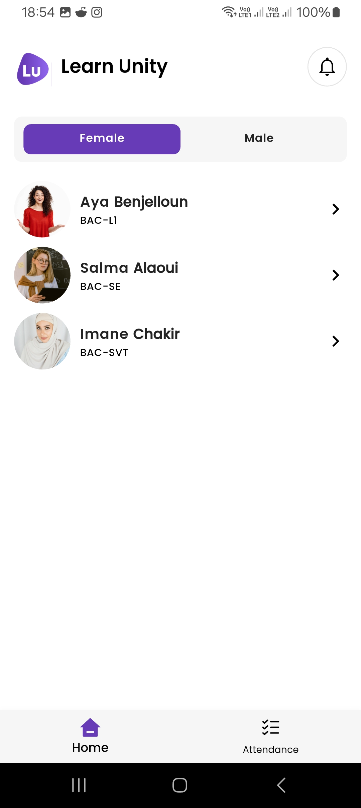
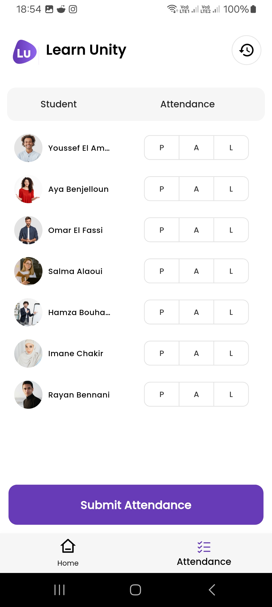
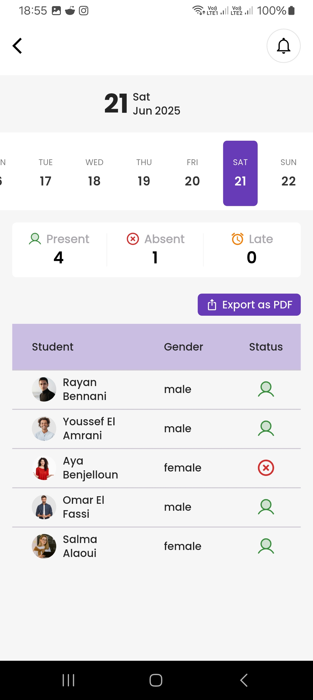
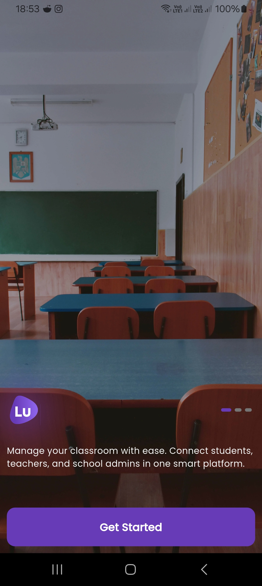
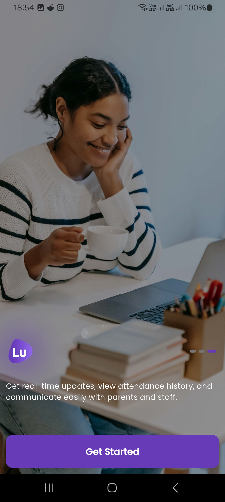
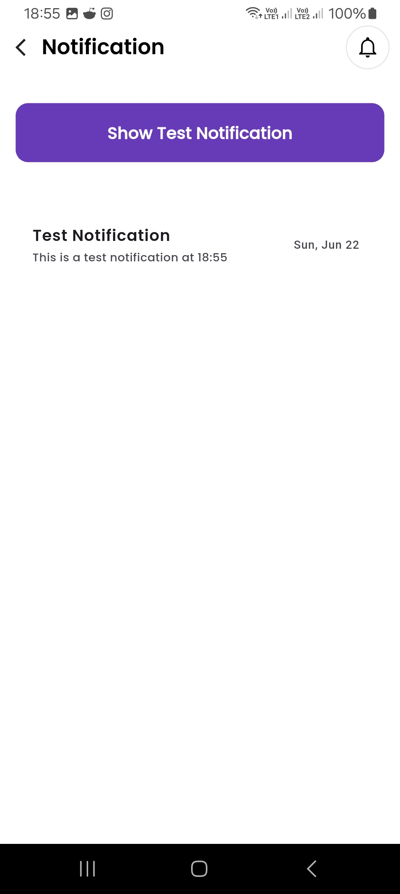

# 📚 Attendance Management 

This is a **Flutter** mobile application built using **Cubit state management** and **Clean Architecture** principles.  
The backend is developed in **Laravel** and hosted on **Hostinger**, served from a subdomain.

---

## 🚀 Features

### ✅ Core Functionalities

- 📋 View all students and their profiles
- 📆 Submit attendance per day
- Splash Screen
- Fetch All Attendance

---

## 🌟 Additional Features

- 👤 **Student Profile Screen**
    - View student details including name, email, and profile picture
    - Call the student via phone number
    - Start a conversation directly on WhatsApp
    - Filter attendance by date or student name
    - View summarized attendance status (Present, Absent, Late)
    - Export attendance as PDF and print it
    - Show and request local notifications

- 📅 **Filtered Attendance**
    - Filter records by selected day

- 📈 **Attendance Status Count**
    - Fetch and display total number of:
        - Present
        - Absent
        - Late

- 📆 **Today's Attendance**
    - Fetch and show attendance records submitted for today

- 🧾 **Export as PDF & Print Support**
    - Generate formatted PDF with logo and dynamic table coloring by status
    - Supports print preview and printing

---

## 📷 App Screens

### 🏠 Home Screen

### 👤 Student Profile

### 📆 Attendance Screen

### 📊 Attendance Status

### 🖨️ Splash Screens (3 screens)

### 📊 Notification

## 🛠️ Tech Stack

| Technology    | Usage                         |
|---------------|-------------------------------|
| Flutter       | Mobile App UI and Logic       |
| Cubit         | State Management              |
| Clean Arch    | Project Structure             |
| Laravel (API) | Backend API Development       |
| Dio           | HTTP Client                   |
| Hostinger     | Laravel API hosting (subdomain)|

---

## 📁 Folder Structure (Clean Architecture)

